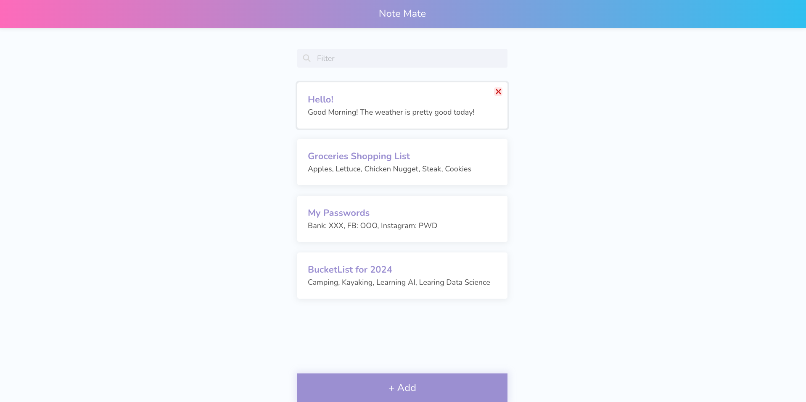
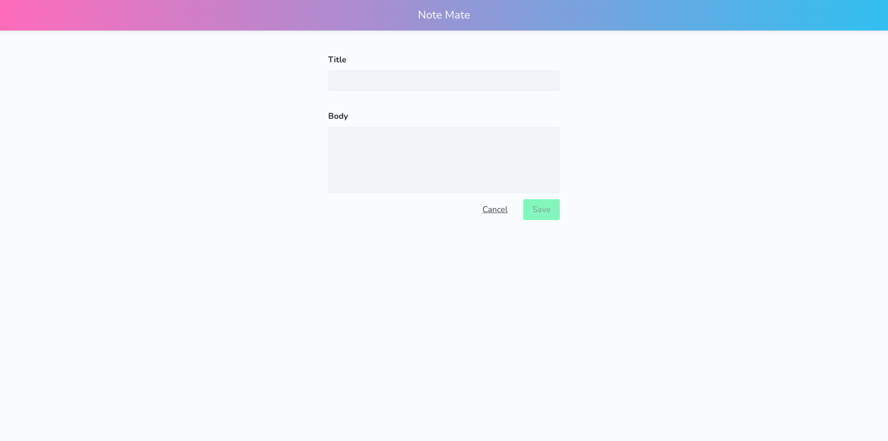
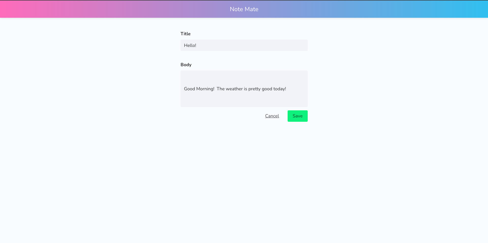

# Introduction
The Notes App is a web application that allows users to create, manage, and filter notes based on specific queries. It provides a convenient way to organize and access notes efficiently.

- Notes List
 

- Create New Note
 

- Edit Note
 

# Deployed URL
The application is deployed and accessible at [NotesAngular](https://chenannchi-notes-angular.netlify.app/).

# Technologies
- Angular
- RxJS
- HTML
- TypeScript
- SCSS
- [Bulma](https://bulma.io/)

# Features and Functionalities
- Create new notes with titles and content.
- Filter notes based on search bar to display relevant notes.

# Next Steps
The following are planned enhancements and features to be added to the NotesAngular App:
- [ ] Responsive design for optimal viewing across devices.
- [ ] Add category functionality to each note for better organization.
- [ ] Implement the ability to display notes by category.
- [ ] Introduce authentication mechanisms to secure user data.
- [ ] Incorporate a database for persistent data storage.
- [ ] Create RESTful API endpoints for seamless integration with backend services.

- Reference
  - Tutorial 
    - [Build a Notes Application with Angular!](https://youtube.com/playlist?list=PLIjdNHWULhPR5cr7nkTvq6kTV8rbr6BVz&si=DyU8zBtnvKC7ka0d)

